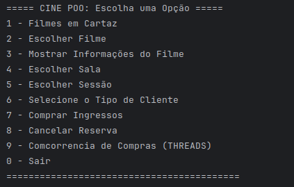

# 🎬 CINE POO

### Bem-vindo ao **CINE POO**, um sistema de venda de ingressos de cinema desenvolvido com foco em **Programação Orientada a Objetos (POO)** e **Concorrência** para gerenciar a reserva de assentos de forma segura e eficiente.

---



---

## 💻 Funcionalidades Principais

### O sistema oferece uma experiência completa de cinema, permitindo ao usuário:

- ### **Gestão de Sessões:** Cadastro e visualização de filmes, salas e horários.
- ### **Reserva de Assentos:** Mapa visual de assentos (`Sala.imprimirMapa()`) e escolha do lugar desejado.
- ### **Processo de Compra:** Seleção da forma de pagamento (Cartão de Crédito, Débito, PIX ou Dinheiro).
- ### **Cancelamento:** Liberação de assento e reset das informações da reserva.
- ### **Simulação de Concorrência (Threads):** Demonstração segura da reserva de um mesmo assento por múltiplos clientes simultâneos, utilizando sincronização.

---

## 🏗️ Estrutura do Projeto

### O projeto segue uma arquitetura orientada a objetos, organizada em pacotes para separar responsabilidades:

```
CinePOO/
│
├── src/
│   └── cinema/
│       ├── concorrencia/          # Implementação de threads e concorrência
│       │   └── TentativaDeCompra.java
│       │
│       ├── main/                   # Classe principal com o menu interativo
│       │   └── Main.java
│       │
│       ├── modelo/                 # Classes de domínio (entidades)
│       │   ├── Cliente.java        # Superclasse
│       │   ├── ClienteComum.java   # Subclasse - sem desconto
│       │   ├── ClienteEstudante.java  # Subclasse - 50% desconto
│       │   ├── ClienteIdoso.java   # Subclasse - 50% desconto
│       │   ├── Filme.java
│       │   ├── Sala.java
│       │   └── Sessao.java
│       │
│       └── pagamento/              # Sistema de pagamento (interfaces e implementações)
│           ├── Cartao.java         # Interface
│           ├── CartaoCredito.java
│           ├── CartaoDebito.java
│           ├── Pagamento.java      # Interface
│           ├── PagamentoCartao.java
│           ├── PagamentoDinheiro.java
│           └── PagamentoPix.java
│
├── .gitignore
├── CinePOO.iml
└── README.md
```

---

## 🌟 Conceitos Chave de POO e Concorrência

### Este projeto aplica de forma prática diversos **pilares da POO** e conceitos de **concorrência**:

### 1️⃣ Abstração e Polimorfismo
- **Interfaces:** Uso das interfaces `Pagamento` e `Cartao` para definir contratos comuns.
- **Polimorfismo:** A variável `Pagamento pagamento` pode referenciar diferentes objetos (`PagamentoPix`, `PagamentoDinheiro`, etc.), permitindo que o método `pagar(valor)` se comporte de forma específica para cada tipo de pagamento.

### 2️⃣ Encapsulamento
- Dados sensíveis, como `capacidade` da `Sala` ou `titulo` do `Filme`, são mantidos como **`private`** e acessados apenas por métodos públicos (`getters` e `setters`), garantindo integridade e segurança.

### 3️⃣ Concorrência e Sincronização
- **Thread Safety:** A classe `TentativaDeCompra` implementa `Runnable` para simular compras simultâneas.
- **Exclusão Mútua:** O bloco `synchronized (salaAlvo)` garante que apenas uma thread por vez execute o método crítico `ocuparAssentoPorNumero()`, evitando que dois clientes reservem o mesmo assento.

---

## ⚡ Tecnologias Utilizadas

- Java 11+
- Threads e sincronização (`synchronized`)
- Programação Orientada a Objetos (POO)  

---

## **👨‍💻  Desenvolvido  por:**

### Jhonata Claudio | Julia Caputo | Luana Roland | Matheus Henrique | Yasmin Vasconcelos

---